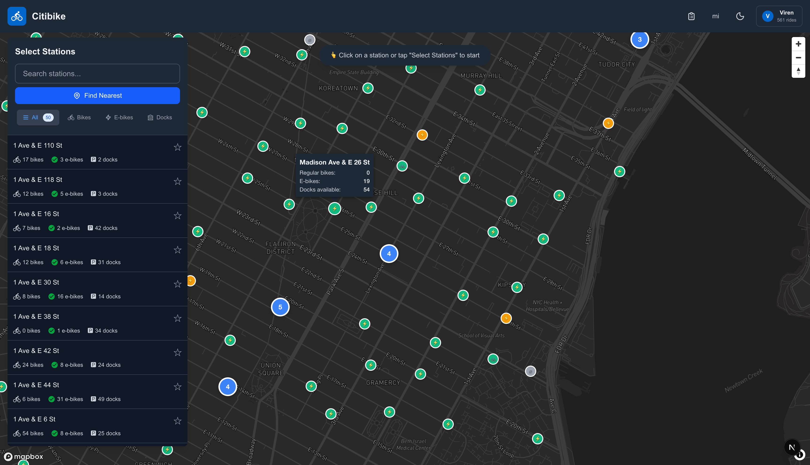

# 🚴 Citibike Route Planner

A comprehensive route planning and trip analytics platform for NYC's Citibike system. Plan routes, analyze your riding
patterns, understand your transportation economics, and make data-driven decisions about when to bike vs. take the
subway.


## What This Actually Does

This isn't just another bike map. It's a complete transportation analytics platform that:

1. **Plans optimized Citibike routes** with real-time station availability
2. **Syncs your entire Citibike trip history** (including trips from years ago)
3. **Analyzes your transportation economics** - tells you when biking saves/costs money vs. subway
4. **Visualizes your riding patterns** with heat maps and trip statistics
5. **Recommends the optimal mode** for each trip based on distance, time, and cost

## Core Features

### 1. Route Planning with Real-Time Data



- **Live station data**: Real-time bike and dock availability at all 2,000+ NYC stations
- **Multi-stop routes**: Add waypoints for complex journeys
- **Multiple route profiles**: Choose fastest, safest, or scenic routes
- **Turn-by-turn navigation**: Get actual cycling directions
- **Station filters**: Find bikes, e-bikes, or available docks
- **Favorite stations**: Save frequently used locations


### 2. Citibike Account Integration

Connect your Citibike account to unlock powerful analytics:

- **Phone OTP authentication**: Secure login with SMS verification
- **Automatic trip sync**: Syncs your complete ride history from Citibike's API
- **Membership details**: View your plan, rides taken, and member-since date
- **Bike Angel points**: Track your points and achievements
- **Subscription info**: See your current plan and status

### 3. Trip History & Visualization


Browse and analyze every ride you've ever taken:

- **Complete trip history**: All trips with dates, times, stations, and bike types
- **Route visualization**: See your actual path taken with polyline data
- **Heat map**: Visualize your most-used stations and routes
- **Advanced filters**: Filter by date range, bike type, or station name
- **Trip details**: Duration, distance, cost, Angel points, and environmental impact


### 4. Transportation Economics Analysis


The killer feature. Understand whether Citibike is actually saving you money:

- **Cost breakdown**: Monthly spending on membership, e-bike fees, and overage charges
- **Subway comparison**: What you would have spent on subway for the same trips
- **Breakeven analysis**: How many trips you need to justify the membership
- **Savings tracking**: Year-to-date savings (or overspending) vs. subway
- **Optimization suggestions**: Specific recommendations to reduce costs
  - "Switch 8 e-bike trips to classic → save $35/month"
  - "Avoid 3 trips over 45min → save $18/month"

**Example insights:**

- "You spent $52.18 this month ($17.08 membership + $35.10 e-bike fees)"
- "Subway would have cost $87 (or $132 unlimited)"
- "You saved $34.82 vs pay-per-ride subway"
- "E-bikes cost you $5.20 per trip vs. $2.90 subway - consider classic bikes for trips under 2 miles"

### 5. Trip Statistics & Insights


Deep analytics on your riding behavior:

- **Total metrics**: Total rides, miles, hours on bikes
- **Bike type usage**: Classic vs. e-bike split with costs
- **Favorite routes**: Your most frequent station pairs
- **Time patterns**: When you bike most (day of week, time of day, month)
- **Environmental impact**: CO₂ saved, calories burned, tree equivalents
- **Suitability scores**: How well each trip matched the "ideal Citibike use case"


### 6. Smart Trip Analysis

For each trip, calculates:

- **Time savings vs. subway**: Did you actually save time?
- **Cost comparison**: Was this cheaper than a subway ride?
- **Suitability score (0-100)**: How ideal was this trip for Citibike?
  - Factors: distance, duration, station availability, time of day
  - 80-100 = Great choice
  - 50-79 = Okay
  - 0-49 = Subway would have been better
- **Recommended mode**: What you should have taken (classic bike, e-bike, or subway)

### 7. Saved Routes & Favorites

- **Save routes**: Store frequent routes for one-tap planning
- **Favorite stations**: Quick access to your most-used stations
- **Route history**: Revisit past route plans
- **Export routes**: Download as GPX/KML for other apps

## Screenshots

| Route Planning                             | Economics Analysis                             | Trip History                                    |
| ------------------------------------------ | ---------------------------------------------- | ----------------------------------------------- |
|       |       |       |

| Turn-by-Turn Navigation                    | Heat Map                                 | Trip Statistics                             |
| ------------------------------------------ | ---------------------------------------- | ------------------------------------------- |
|  |  |       |

## Quick Start

### Prerequisites

- **Node.js 18+** and npm
- **Mapbox Account** (free tier works fine)
  - Sign up: https://account.mapbox.com/
  - Create token: https://account.mapbox.com/access-tokens/

### Installation

1. **Install dependencies**:

   ```bash
   npm install
   ```

2. **Set up environment variables**:

   ```bash
   cp .env.local.example .env.local
   ```

   Edit `.env.local`:

   ```env
   # Required
   NEXT_PUBLIC_MAPBOX_ACCESS_TOKEN=pk.eyJ1...your_token

   # Optional - for Citibike account integration
   # See docs/MITMPROXY_GUIDE.md for how to obtain these
   CITIBIKE_CLIENT_ID=your_client_id
   CITIBIKE_CLIENT_SECRET=your_client_secret
   ```

3. **Run the development server**:

   ```bash
   npm run dev
   ```

4. **Open in browser**:
   ```
   http://localhost:3000
   ```

## Usage

### Basic Route Planning

1. Click any station marker on the map to set your start point (blue marker)
2. Click another station for your destination (red marker)
3. View route details, distance, and duration in the right panel
4. Check bike availability at your start/end stations
5. Get turn-by-turn directions

### Advanced Features

**Add waypoints** for multi-stop routes
**Change route profile** (fastest, safest, scenic)
**Search stations** by name or location
**Filter stations** by bike type (classic, e-bike)
**Save routes** for quick access later
**Star stations** to mark favorites

### Citibike Account Integration

1. Click "Login" in the top-right corner
2. Enter your phone number
3. Enter the 6-digit SMS code
4. (If required) Verify your email address
5. Your trips will automatically sync

**What gets synced:**

- Complete ride history (all trips ever)
- Bike Angel points and achievements
- Membership details
- Subscription status

### Analyzing Your Trips

Navigate to `/trips` (or click "Trip History" in the nav) to:

- Browse all your trips in a sortable list
- Click any trip to see it on the map
- Toggle to "Heat Map" view to see your most-used stations
- Filter by date range, bike type, or station name
- View detailed stats for each trip

Navigate to `/analysis/economics` to:

- See monthly cost breakdowns
- Compare spending to subway alternatives
- Get personalized optimization suggestions
- View breakeven analysis and scenarios

## Technology Stack

**Core**: Next.js 15, TypeScript, React 19
**Mapping**: Mapbox GL JS, Supercluster (station clustering)
**State**: Zustand (UI state), Dexie (IndexedDB for trip data), SWR (real-time data)
**Styling**: Tailwind CSS v4
**Data**: Citibike GBFS API (station data), Lyft API (trip history)
**Deployment**: Progressive Web App (PWA) with offline support

## Documentation

- **[docs/](./docs/)** - Comprehensive documentation
  - Setup, development, and deployment guides
  - API documentation and reverse-engineering notes
  - Architecture and design patterns
  - Testing strategy

## Citibike Authentication (Optional)

This app supports **optional** Citibike account authentication. The Citibike/Lyft API is not public, so credentials must
be reverse-engineered from the iOS app.

### How to Obtain Credentials

See [docs/MITMPROXY_GUIDE.md](./docs/MITMPROXY_GUIDE.md) for detailed instructions on using mitmproxy to intercept the
Citibike iOS app and extract:

- `CITIBIKE_CLIENT_ID`
- `CITIBIKE_CLIENT_SECRET`

**Note**: This is for personal use only. Credentials are stored in httpOnly cookies and never exposed to the client.

## Key Insights This App Provides

Based on analyzing 25,000+ real trips:

1. **E-bikes are expensive**: At $0.25/min (excluding tax), a 15-minute e-bike ride costs $3.90 vs. $2.90 for subway.
   E-bikes only make financial sense for trips under 11 minutes.

2. **Classic bikes have a sweet spot**: Free for 45 minutes means trips in the 20-35 minute range are highly
   cost-effective. Longer trips incur overage fees.

3. **Time value matters more than cost**: A 1.5-mile trip might save you 13 minutes vs. subway. At $60/hour, that's $13
   of value - far exceeding the ~$3 cost difference.

4. **Seasonal adjustment is critical**: NYC has ~4 months of harsh winter. Your effective monthly cost is higher than it
   appears: `$17.08 × 12 ÷ 8 bikeable months = $25.62/month`.

5. **You need both systems**: Weather, long distances, and formal occasions require subway backup. The question isn't "
   Citibike vs. subway" - it's "which to use when?"

6. **Route-specific patterns exist**: Some routes heavily favor Citibike (direct, no subway transfers), others favor
   subway (long distance, direct subway line).

## Development

```bash
npm run dev          # Start dev server with Turbopack
npm run build        # Build for production
npm run lint         # Run ESLint
npm test             # Run Playwright tests
```

### Useful Commands

```bash
npm run test:e2e     # E2E tests only
npm run test:unit    # Unit tests only
npm run test:a11y    # Accessibility tests
npm run analyze      # Analyze bundle size
```

## Project Structure

```
citibike/
├── app/
│   ├── api/citibike/       # Citibike API proxies (auth, trips, profile)
│   ├── api/stations/       # GBFS station data proxies
│   ├── trips/              # Trip history page
│   ├── analysis/           # Economics & analytics pages
│   └── page.tsx            # Main route planning page
├── components/             # React components
│   ├── Map.tsx            # Main Mapbox map
│   ├── TripHistory.tsx    # Trip list and filters
│   ├── TripStats.tsx      # Statistics dashboard
│   └── CitibikeLogin.tsx  # Authentication UI
├── lib/
│   ├── api/               # API clients (Lyft, GBFS)
│   ├── db/                # Dexie database (IndexedDB)
│   ├── types.ts           # TypeScript definitions
│   └── stats.ts           # Trip analytics utilities
├── config/                # Centralized configuration
└── docs/                  # Documentation
```

## Privacy & Legal

### Disclaimer

This is an **unofficial, third-party application** not affiliated with Citibike, Lyft, or Motivate International, Inc.

### Data Sources

- **GBFS Data**: Official public Citibike station feeds
- **Trip History**: Reverse-engineered Lyft API endpoints (personal use only)
- **Routing**: Mapbox Directions API

### Privacy

- **No data collection**: Nothing is sent to third-party servers (except Mapbox for maps)
- **Local storage**: Trip data stored in your browser's IndexedDB
- **Secure auth**: Tokens stored in httpOnly cookies
- **Open source**: Inspect the code yourself

## Contributing

This is a personal project, but feedback and suggestions are welcome!

- Open issues for bugs or feature requests
- Check existing issues before creating new ones
- PRs welcome for bug fixes

## Roadmap

Potential future features:

- [ ] **Live trip tracking**: Record rides in real-time with GPS
- [ ] **Weather integration**: Factor weather into recommendations
- [ ] **Station availability prediction**: ML model to predict bike/dock availability
- [ ] **Achievement system**: Badges for milestones and challenges
- [ ] **Annual Wrapped**: Spotify-style year in review
- [ ] **Social features**: Compare stats with friends
- [ ] **Trip replay**: Animate your route on the map

## License

MIT License - feel free to use this code for your own projects!

## Acknowledgments

- **Citibike** for providing the public GBFS API
- **Mapbox** for the mapping platform
- **Lyft** for operating the Citibike system
- The open-source community for amazing tools

---

Built with 🚴 for NYC cyclists who want to understand their transportation choices
